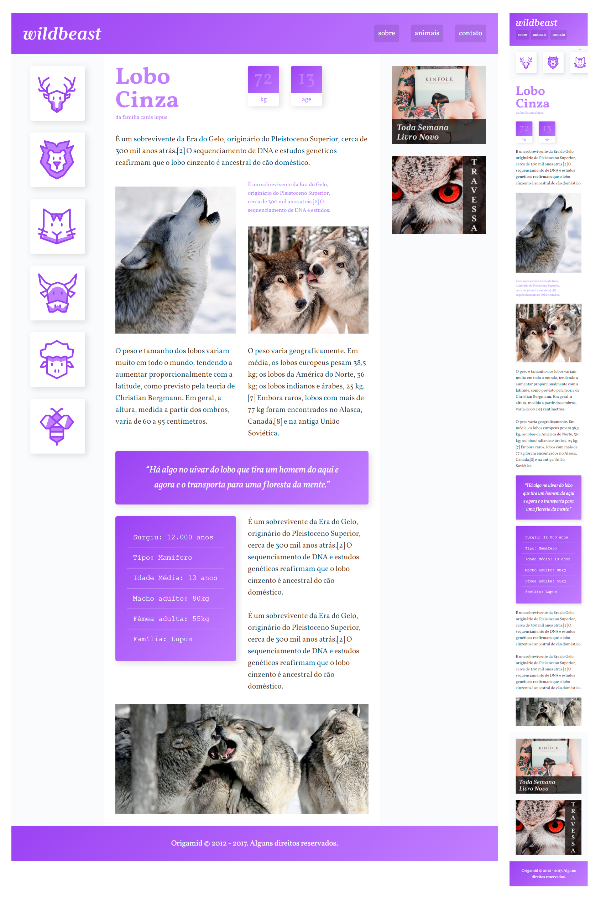

<p align='center'></p>
<h1 align='center'>Wildbeast - Curso CSS Grid | Origamid </h1>
<br>
<p align='center'>


</p>

<h3>🔖 Sobre o projeto</h3>
<p>Projeto do curso de CSS Grid Layout onde aprendi como criar um layout responsivo no CSS utilizando as propriedades do CSS Grid Layout. Com ele é possivel criar layouts complexos utilizando e ainda manter a marcação do HTML limpa.  <p>

<h3>🚀 Tecnologias</h3>
<ul>
    <li>Html</li>
    <li>Css Grid</li>
</ul>

<h3>ℹ️ Como usar</h3>

<h4>ℹ️ Pré-requisitos</h4>

<ul>
    <li><a href="https://git-scm.com/" target="_blank">Git</a></li>
    <li><a href="https://marketplace.visualstudio.com/items?itemName=ritwickdey.LiveServer" target="_blank">Live Server</a></li>
</ul>

<h4>ℹ️ Rodando Projeto</h4>

```bash

# Clone o repositório
$ git clone https://github.com/Diegooliveyra/Wildbeast.git

# Acesse a pasta do projeto no terminal
$ cd src/
Abra o projeto pelo Live serve no VSCode

# Execute o arquivo
$ index.html

```

</br>


<h3>🖼 Layout</h3>



<h3>📝 Licença</h3>
<p>O projeto se encontra sob licença MIT. Para mais detalhes, acesse <a href='LICENSE'>license<a>.</p>
<p>Criado com 💙 por <a href='https://github.com/Diegooliveyra/' target='blank'>Diego Oliveira</a></p>
